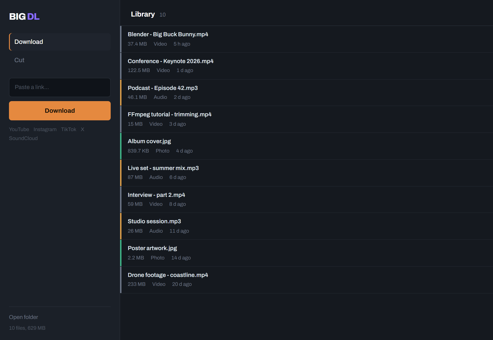

# BIG DL

Download videos, audio and photos from YouTube, Instagram, TikTok, X/Twitter and SoundCloud. Trim any audio or video file with the built-in visual editor.



*The library shown here is made up.*

## What it does

- **YouTube** — video up to 4K, MP3 audio, shorts, whole playlists
- **Instagram** — reels, videos, photos (photos need a cookies file)
- **TikTok** — videos without the watermark
- **X / Twitter** — videos from posts
- **SoundCloud** — tracks as MP3
- **Trimming** — a dedicated tab to cut an audio or video file with a visual slider, frame-accurate
- **Stop** — a button to stop a download or a cut in progress, and start another right away
- **Library** — everything downloaded so far, with playback, reveal in Explorer and deletion

## Install

### Option 1: the Windows executable (recommended)

Download `BigDownloader.exe` from the [latest release](https://github.com/NotDjz/Big_download/releases/latest) and run it. That is all.

Windows SmartScreen will object: the binary is unsigned. Choose "More info", then "Run anyway". What the executable does to your machine is laid out on [the project page](https://notdjz.github.io/Big_download/).

### Option 2: from source

```bash
git clone https://github.com/NotDjz/Big_download.git
cd Big_download
py download_ffmpeg.py
install.bat
run.bat
```

Requirements: Python 3.10+. FFmpeg does not have to be installed system-wide, but it does have to be there before `install.bat`, which checks for it and stops if it is missing — that is what `py download_ffmpeg.py` is for.

## Using it

1. Launch the application
2. Paste a link into the field
3. Pick a format (video, audio, photo)
4. Download

Files are filed automatically into `downloads/Videos/`, `downloads/Music/` and `downloads/Photos/`, in the executable's own directory.

### Trimming

Open the **Cut** tab, drop in an audio or video file, drag the two handles to the part you want to keep, and click Cut. The result is saved next to the original name with `_v2`, then `_v3`, and so on. The original file is never touched.

## Instagram cookies

Instagram **photos** need a cookies file. Videos and reels work without one.

1. Install the [Get cookies.txt LOCALLY](https://chromewebstore.google.com/detail/get-cookiestxt-locally/cclelndahbckbenkjhflpdbgdldlbecc) browser extension
2. Go to instagram.com and sign in
3. Export the cookies
4. Put the `cookies.txt` file beside the executable

That file is your Instagram session in plain text. Keep it out of any repository.

## Tests

```bash
py tests/server_tests.py      # server side, offline, a few seconds
py tests/run_ui_smoke.py      # drives the real interface in headless Chrome
```

## Build

```bash
py download_ffmpeg.py
build.bat
```

The executable lands in `dist/BigDownloader.exe`.

Distribute that file and nothing else. `dist/` is also where a portable run writes its own `downloads/`, `temp_uploads/` and `cookies.txt` — sharing the folder would share your Instagram session.

## Licence

[MIT](LICENSE)
